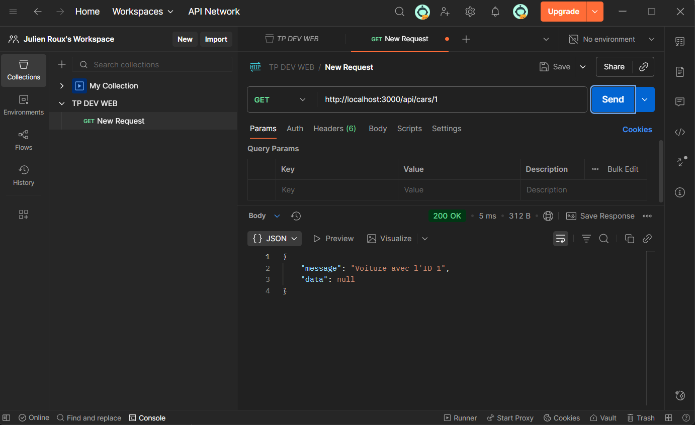
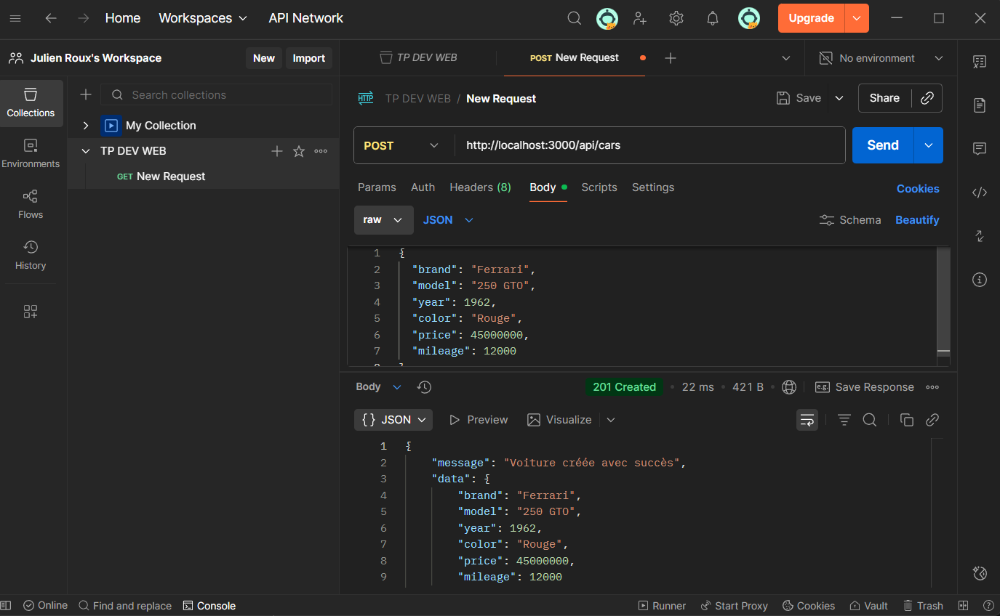
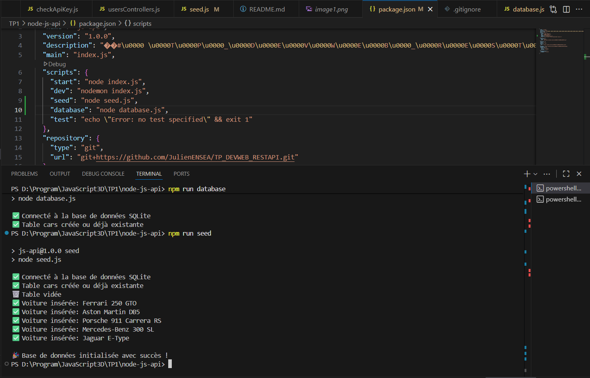
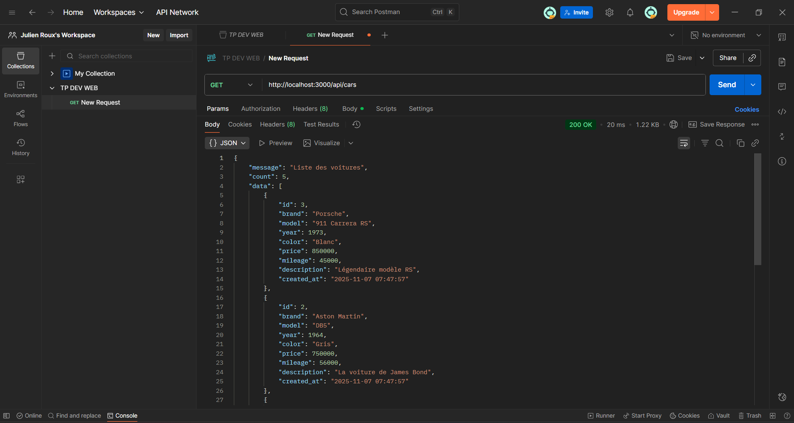
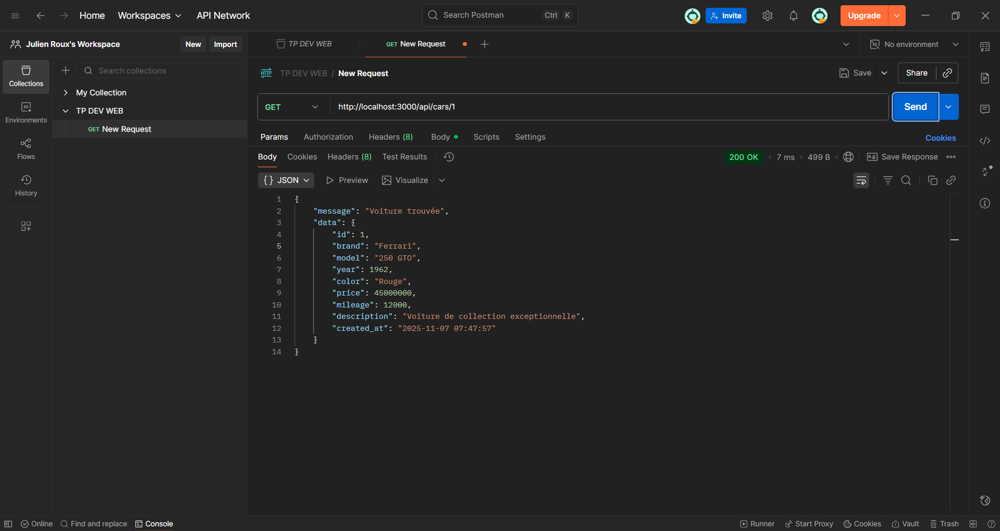
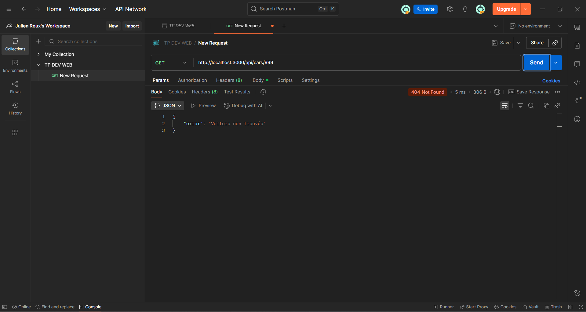

# TP_DEVWEB_RESTAPI

Roux Julien | Bairouki Yanis

# TP 1:






# TP 2:





Message retourné par POSTMAN : 

{
    "message": "Liste des voitures",
    "count": 5,
    "data": [
        {
            "id": 3,
            "brand": "Porsche",
            "model": "911 Carrera RS",
            "year": 1973,
            "color": "Blanc",
            "price": 850000,
            "mileage": 45000,
            "description": "Légendaire modèle RS",
            "created_at": "2025-11-07 07:47:57"
        },
        {
            "id": 2,
            "brand": "Aston Martin",
            "model": "DB5",
            "year": 1964,
            "color": "Gris",
            "price": 750000,
            "mileage": 56000,
            "description": "La voiture de James Bond",
            "created_at": "2025-11-07 07:47:57"
        },
        {
            "id": 1,
            "brand": "Ferrari",
            "model": "250 GTO",
            "year": 1962,
            "color": "Rouge",
            "price": 45000000,
            "mileage": 12000,
            "description": "Voiture de collection exceptionnelle",
            "created_at": "2025-11-07 07:47:57"
        },
        {
            "id": 5,
            "brand": "Jaguar",
            "model": "E-Type",
            "year": 1961,
            "color": "Bleu",
            "price": 320000,
            "mileage": 78000,
            "description": "Icône du design automobile",
            "created_at": "2025-11-07 07:47:57"
        },
        {
            "id": 4,
            "brand": "Mercedes-Benz",
            "model": "300 SL",
            "year": 1955,
            "color": "Argent",
            "price": 1200000,
            "mileage": 34000,
            "description": "Portes papillon emblématiques",
            "created_at": "2025-11-07 07:47:57"
        }
    ]
}





Séance 3 : Contrôleurs et architecture MVC

Dans cette étape, on sépare le code en plusieurs fichiers :

- **controllers/** pour la logique métier (interactions avec la base)
- **models/** pour la gestion des données (SQL)
- **app.js** pour la configuration principale du serveur

Cela améliore la lisibilité, la maintenabilité et permet de faire évoluer le projet plus facilement.


Séance 4 : 

Pour sécuriser l’accès à notre API, on met en place un **middleware** vérifiant une clé API dans les headers de chaque requête.\
` `Sans cette clé, l’accès est refusé.
```json
|<p>const express = require('express');</p><p>const bodyParser = require('body-parser');</p><p>const cors = require('cors');</p><p>const carsController = require('./controllers/usersControllers');</p><p>const app = express();</p><p>const PORT = process.env.PORT || 3000;</p><p>const checkApiKey = require('./middleware/checkApiKey');</p><p>// Middlewares</p><p>app.use(cors());</p><p>app.use(bodyParser.json());</p><p></p><p>// Route de bienvenue</p><p>app.get('/', (req, res) => {</p><p>`  `res.json({ </p><p>`    `message: 'Bienvenue sur l\'API de gestion de voitures classiques',</p><p>`    `version: '1.0.0',</p><p>`    `endpoints: {</p><p>`      `getAllCars: 'GET /api/cars',</p><p>`      `getCarById: 'GET /api/cars/:id',</p><p>`      `createCar: 'POST /api/cars',</p><p>`      `updateCar: 'PUT /api/cars/:id',</p><p>`      `deleteCar: 'DELETE /api/cars/:id'</p><p>`    `}</p><p>`  `});</p><p>});</p><p></p><p>// Routes CRUD (protégées par le middleware)</p><p>app.get('/api/cars', checkApiKey, carsController.getAllCars);</p><p>app.get('/api/cars/:id', checkApiKey, carsController.getCarById);</p><p>app.post('/api/cars', checkApiKey, carsController.createCar);</p><p>app.put('/api/cars/:id', checkApiKey, carsController.updateCar);</p><p>app.delete('/api/cars/:id', checkApiKey, carsController.deleteCar);</p><p></p><p>// Gestion des routes non trouvées</p><p>app.use((req, res) => {</p><p>`  `res.status(404).json({ </p><p>`    `error: 'Route non trouvée',</p><p>`    `message: `La route ${req.method} ${req.url} n'existe pas` </p><p>`  `});</p><p>});</p><p></p><p>// Démarrage du serveur</p><p>app.listen(PORT, () => {</p><p>`  `console.log(`🚀 Serveur démarré sur le port ${PORT}`);</p><p>`  `console.log(`📍 [http://localhost:${PORT}`]());</p><p>});</p><p></p>|
| :- |
```

```json
|<p>// Middleware pour vérifier la clé API</p><p>const checkApiKey = (req, res, next) => {</p><p>`  `// Récupérer la clé API depuis les headers</p><p>`  `const apiKey = req.headers['x-api-key'];</p><p>  </p><p>`  `// Clé API attendue (en production, stockez-la dans des variables d'environnement)</p><p>`  `const validApiKey = 'ma-super-cle-api-2025';</p><p>  </p><p>`  `// Vérification</p><p>`  `if (!apiKey) {</p><p>`    `return res.status(401).json({</p><p>`      `error: 'Non autorisé',</p><p>`      `message: 'Clé API manquante. Ajoutez le header x-api-key à votre requête'</p><p>`    `});</p><p>`  `}</p><p>  </p><p>`  `if (apiKey !== validApiKey) {</p><p>`    `return res.status(403).json({</p><p>`      `error: 'Accès refusé',</p><p>`      `message: 'Clé API invalide'</p><p>`    `});</p><p>`  `}</p><p>  </p><p>`  `// Si tout est OK, on passe au prochain middleware/route</p><p>`  `console.log('✅ Clé API valide');</p><p>`  `next(<a name="_int_zpvauomr"></a>);</p><p>};</p><p></p><p>module.exports = checkApiKey;</p><p></p>|
| :- |
```


J'ai mis “clé” au lieu de “ma-super-cle-api-2025" donc ça ne peut pas fonctionner


